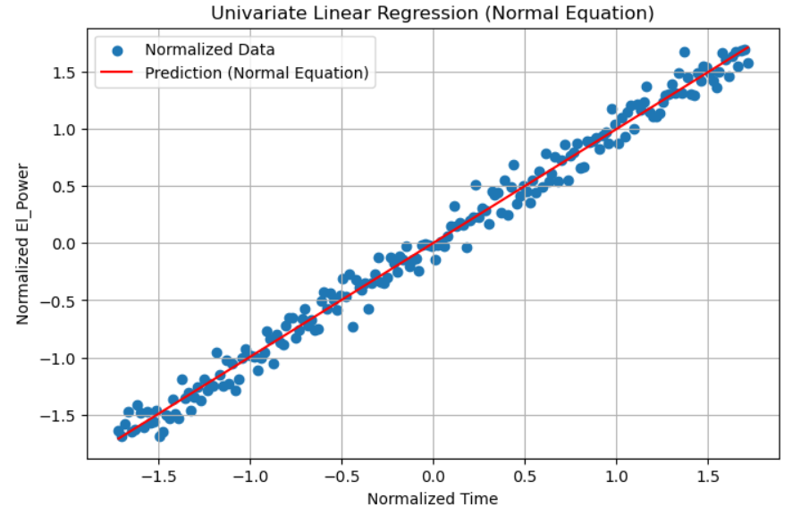

# Univariate Linear Regression with Normal Equation

This project demonstrates a general-purpose implementation of **Univariate Linear Regression using the Normal Equation**, built from scratch with NumPy and Matplotlib.

---

## 🔍 Overview

Linear Regression is one of the most fundamental machine learning algorithms used to model the relationship between a single input feature and a continuous target.

This project:

- Builds a regression model without using high-level ML libraries
- Uses normalized data to ensure stable training
- Computes model parameters using the closed-form Normal Equation
- Visualizes model predictions with matplotlib

---

## 🧠 Key Concepts

- **Univariate Regression**: Models the relationship between one feature (`time`) and a target (`el_power`)
- **Normal Equation**: Computes parameters analytically without iteration
- **Bias Term (Intercept)**: Included to allow vertical shift of the regression line
- **Feature Normalization**: Ensures numerical stability and faster convergence

---

## 📁 Files Included

- `linear_regression.py`: Main Python script implementing the model
- `ex_1.csv`: Dataset containing `time` and `el_power`
- `bias explination.png`: Matrix representation of the model equation
- `result.png`: Final plot of predicted vs actual values
- `requirements.txt`: List of required Python packages
- `README.md`: This documentation

---

## 📈 Visualizations

### 📌 Model Equation

The model fits a line using the matrix equation:


Which expands to:

```
y = Xw
```

Where `X` includes a column of ones (for bias) and your feature values, and `w` contains `[b, m]`.

---

### 📌 Prediction vs Actual

This plot shows how well the model fits the data:



The red line represents predicted values, and the blue dots are the actual data points after normalization.

---

## ▶️ How to Run

1. Make sure you have Python installed.
2. Install the required packages:

```bash
pip install numpy pandas matplotlib
```

3. Run the script:

```bash
python linear_regression.py
```

---

## 📦 Output

The program prints the learned model equation in the format:

```
Model y = [weight] * x + [bias]
```

For example (on sample data):

```
Model y = 0.987 x + -0.004
```

It then shows a scatter plot of the data and the fitted regression line.

---

## 💡 Extras

- The script automatically normalizes all features
- Bias is added explicitly in the feature matrix
- The solution uses the formula:  
  ```
  w = (Xᵀ X)⁻¹ Xᵀ y
  ```

---

## 🧪 Example Use Cases

- Forecasting energy consumption
- Modeling trends over time with a single variable
- Learning how closed-form linear models work

---

## 📄 License

This project is licensed under the **MIT License**. Feel free to use, modify, and share it.

---

## 🙌 Author

Built with ❤️ using NumPy and Matplotlib.

